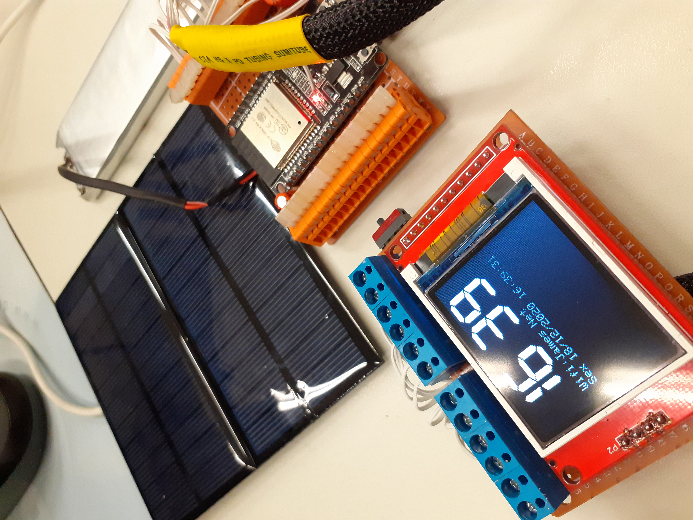
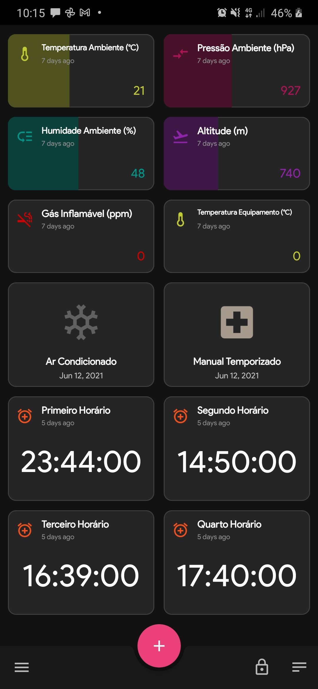

## Monitoramento de Condições Atmosféricas e Atmosfera Explosiva

Esta Firmware foi elaborada para monitoramento atmosférico através do ESP32 e sensores BME280 e MQ2. São dados de altitude, humidade, temperatura e pressão atmosférica, também dados do sensor de gases inflamáveis, que podem indicar uma atmosfera explosiva. Esses dados podem ser trabalhados para acionar equipamentos, saídas ou mesmo serem analizados por sistemas que possam tomar uma decisão, através dos dados que são enviados via protocolo MQTT(baixo uso de dados para IoT) em servidor virtual linux instalado no Google Cloud Platform. Os sensores captam os sinais analógicos via barramento I2C e publicam através do ESP32 um tópico em nuvem que pode ser acessado por clientes em dispositivos móveis, PC, painéis de bordo, serem trabalhados através de Storytelling, Machine Learning, e tudo que se relaciona a trabalho com Big Data.

### Aquisição e envio dos dados
Os dados são adquiridos e enviados via Wifi, mas a estrutura do código permite fácil adaptação pra GSM, ou mesmo LoRa. O Wifi que já está implementado, utiliza-se da configuração por usuário, o ESP32 entra em modo de AP e busca as redes próximas e o usuário com o celular pode-se conectar a rede e inserir senha para acesso, ficando totalmente flexível e robusta a personalização da rede a ser utilizada. As conexões são realizadas levando em conta dentro das redes salvas no sistema de arquivos SPIFFS, a de maior sinal.

  

### Autonomia energética
Foi implementado um sistema de controle de carga da bateria de LiPo(2500mA) junto a placa solar que regula com um MCP1700 low dropout a tensão de 3,3V.

  

### Protocolo MQTT
Através desse incrível protocolo se publica ou se lê mensagens em JSON ou mesmo com cargas personificadas, que são sinais de sensores, informações digitais e dados. Os dados são enviados em tempo real. 

### FreeRTOS
No código foram coordenadas as tarefas em dois núcleos sendo o Display o ponto crítico de utilização, pois, devido a requisição de tempo para tarefas adjacentes, se não fosse utilizado um artifício para parlelismo da função do display, o mesmo seria congelado durante a excução de outra tarefa. Trabalhando em outro núcleo físico, ficou independente, principalmente porque mostra um relógio digital e é atualizado em tempo real.

### Clientes de subscrição
Nesse demonstrativo de aplicação, o servidor com IP fixo em nuvem e o Broker MQTT Eclipse Mosquitto atuam de forma sempre a armazenarem os últimos dados de cada sensor ou comando, mesmo se o equipamento for desligado, os valores são salvos em arquivo em nuvem, trazendo segurança principalemte para aquisições críticas como industriais, médicas e militares. Os dados podem ser acessados com usuário e senha, se fazendo um subscribe no tópico a ser lido(sensor), ou em todos tópicos, sendo assim não geram dados de entrada no servidor. Os alarmes acrescentados na Firmware são enviados para o ESP32 e salvos em aqruivo interno na memória não volátil, e estes podem ser utilizados para acionamento das saídas. como exemplo foi lido em um celular os sinais adquiridos em tempo real.

  

