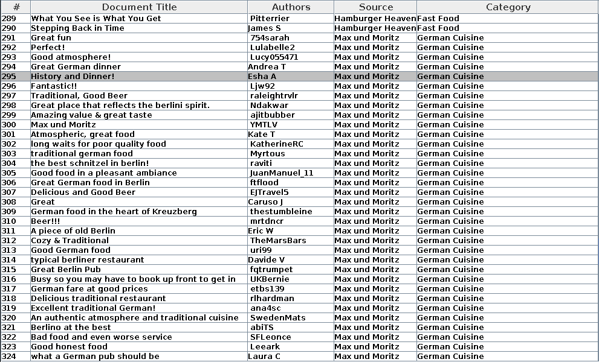
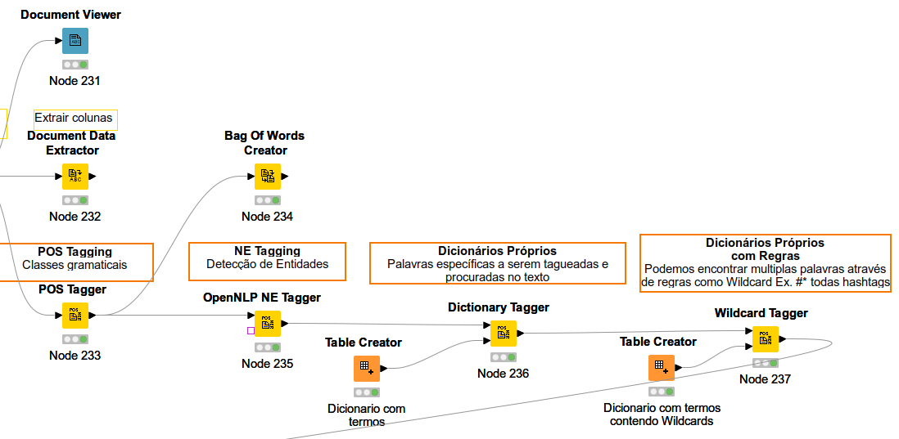
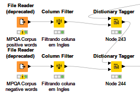
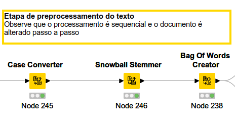
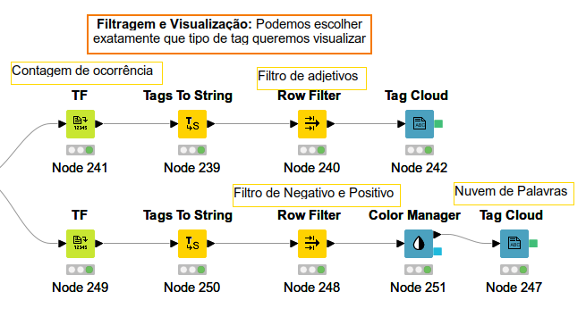

## Sentimento dos reviews de usuários sobre restaurantes em lingua inglesa (Tripadvisor) com Knime

  Este modelo foi elaborado com o software ETL Knime, para estudo de Data Science. O código utilizado para gerar todos resultados abaixo encontra-se no repositório.

### O Problema de Negócio
  Para se entender atráves de reviews de usuários, como está sendo visto o setor de restaurante, foi proposto este projeto, que no caso, avalia como resultado final duas Tag-clouds, uma que representa palavras chaves em uma nuvem aleatória, com grau de relevância determinado por TF-IDF(frequência e raridade) e outra que já demonstra com adjetivos positivos e negativos o sentimento de usuários e a relevância de cada termo no contexto geral da base pesquisada.
  
### Sobre o Tripadvisor
  O Tripadvisor, a maior plataforma de viagens do mundo*, ajuda 463 milhões de viajantes todos os meses** a tornar cada viagem a melhor de todas. Pessoas do mundo todo usam o site e o aplicativo do Tripadvisor para acessar mais de 859 milhões de avaliações e opiniões sobre 8,6 milhões de acomodações, restaurantes, experiências, companhias aéreas e cruzeiros. Seja na fase de planejamento ou durante a viagem, o Tripadvisor é usado para comparar preços baixos de hotéis, voos e cruzeiros, para reservar excursões e atrações badaladas, além de para fazer reservas em ótimos restaurantes. O Tripadvisor, o melhor companheiro de viagem, está disponível em 49 mercados e 28 idiomas. (texto oficial do site)

### Explanação do projeto no Knime

  

#### Aquisição dos dados
  Os dados foram adquiridos de uma base de dados da empresa Tripadvisor, sendo uma base já inserida no projeto e que está em lingua inglesa. Nesta fase inicial foram retirados os reviews que não faziam mensão ao local ou com dados faltantes. O banco de dados vai ser passado por módulos onde será filtrado, tratado, inserido em um modelo aprendido de traços de linguagem natural NLP até atingir o ponto de visualização final.
  

  

#### Base tranformada em documento

  

#### Fase de pré-processamento inicial
  Nesta fase faz-se o tageamento das palavras nas condições fixadas, criando rótulos como classes gramaticais, separação em tipos e intensões.
  

  

#### Separação dos sentimentos em Positivos e Negativos
   Usando tabelas de dicionários da lingua inglesa, separa-se as palavras em positivas e negativas.
   

  

#### Fase de pré-processamento final
  Aqui todas palavras serão convertidas em minúsculo e retirado partes de conjugação e deixado gramaticamente somente o radical da palavra.
  

  

#### Relevância e processamento
  Nesta fase se faz a contagem para a relevância de cada radical de palavra.
  

  

#### Nuvem geral com todos adjetivos relevantes

  

#### Nuvem com sentimentos divididos em Positivos e Negativos

  

