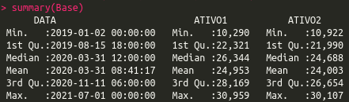
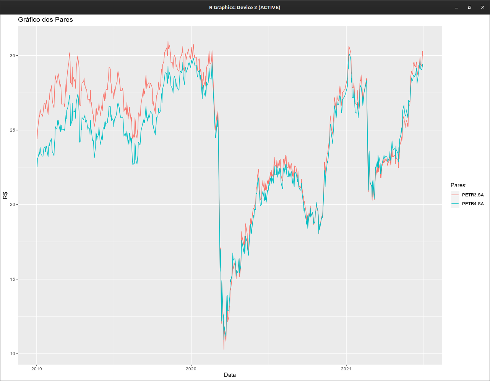
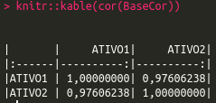
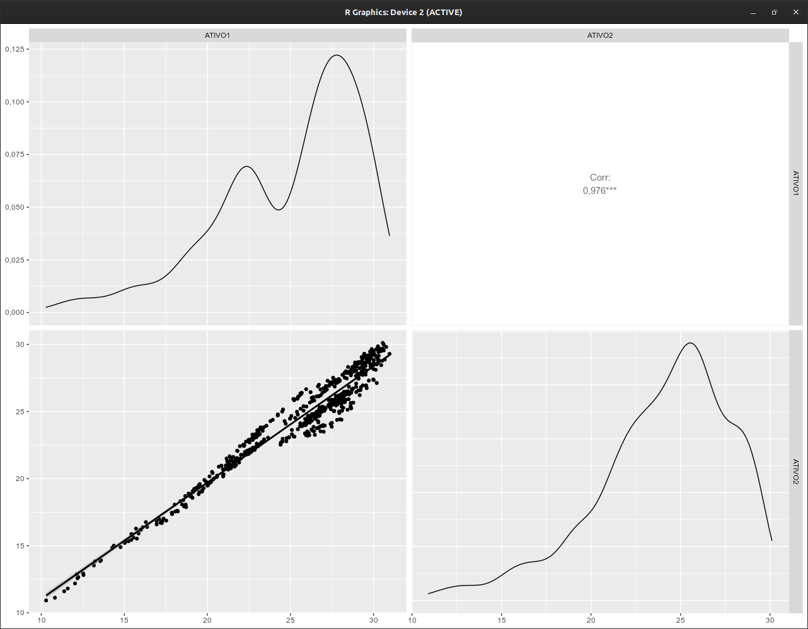
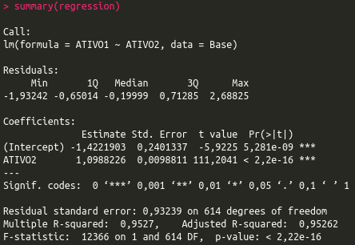
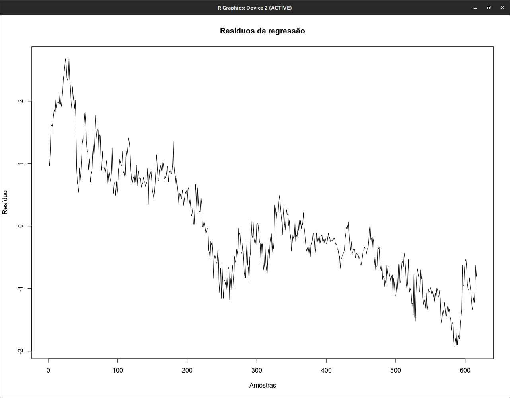
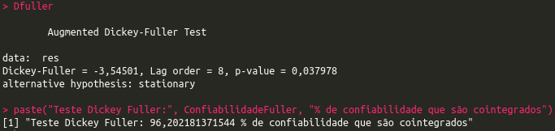

## Long & Short por Cointegração

Este modelo foi elaborado com linguagem R, no ambiente do RStudio, para validação do par de ativos como cointegrados. O código utilizado para gerar todos resultados abaixo encontra-se no repositório.

### O que é Long & Short?
Quando se está comprado em um determinado ativo A na carteira que se acredita na valorização com o tempo, se está long(comprado) nesse ativo. O oposto disso é estar short(vendido). Nesse caso, se ganha dinheiro quando um determinado ativo B se desvaloriza.

Essas duas operações podem ser performadas separadamente: pode-se estar comprado no ativo A ou apenas vendido no ativo B. Contudo, existe também a possibilidade de se aproveitar as relações entre dois ativos e, com o dinheiro recebido por vender o ativo B, comprar o ativo A. Nesse caso, a operação recebe o nome de Long & Short.

### Séries Estacionárias e Não-Estacionárias
Tradicionalmente, as operações de L&S se baseiam no método da correlação. Esse método busca algum tipo de dependência linear entra duas variáveis independentes. Por exemplo, se dois ativos estão correlacionados, uma variação em um ativo A corresponde a uma variação na mesma direção do ativo B (caso a correlação seja positiva), ou em sentidos opostos (caso a correlação seja negativa).

No entanto, a correlação não leva em consideração a variação dos dados(também chamadas de séries) com o tempo. Para que uma estratégia de Long & Short possa ser validada, é preciso determinar se a série é estacionária no tempo.

Uma série estacionária é toda série cujas propriedades estatísticas como média, variância ou covariância não variam com o tempo. Logo, o oposto disso é chamado de série não-estacionária, ou seja, séries que possuem média, variância e covariância dependentes do tempo.

### Dados
Foram utilizados dados da PETR3 e PETR4 como possível par de Long & Short, coletados no site Yahoo Finance, com recorte temporal de 01/01/2019 a 31/12/2021(a série trata a data final mesmo se ainda incompleta) do valor ajustado(leva em conta dividendos, splits e outros) periodicidade diária.

  

### Os pares
Plotagem dos pares para visualmente analisarmos se existe alguma relação entre eles e se os dados em si são estacionários no tempo.

Não existe nenhum tipo de estacionaridade neles. Contudo, a visualização sugere que existe uma relação entre os pares.

  

### Correlação
Fazendo um teste de correlação, vemos que existe uma alta correlação entre os ativos da Petrobras no período de tempo que escolhemos para análise. Se fossemos seguir uma estratégia baseado apenas na correlação, esse resultado estaria nos dizendo para prosseguir com a operação.

  

 

Porém, como visto anteriormente, a correlação de pares não-estacionários na verdade varia com o tempo. Nesse sentido, essa correlação pode deixar de ser verdadeira em um próximo período. Deve-se então calcular a Cointegração(validar esta relação) dos ativos, através dos resíduos da regressão linear, que mostrará de forma mais precisa se a relação entre os dois ativos é permanente.

  

 

### Ajuste de um modelo linear
É produzido então uma regressão linear para aquisição dos resíduos e posterior análise dos mesmos.

O output da regressão linear nos dará os coeficientes da reta y=βx+by que melhor aproxima os nossos dados.

  

 

### Cálculo do resíduo
O segundo passo é calcular o resíduo. Agora que tem-se o valor previsto de Y, o resíduo(ou erro) pode ser calculado como a diferença entre o ponto previsto (calculado pelo modelo linear) e o ponto observado (o valor observado na realidade).

Para evitar ao máximo critérios subjetivos na análise quantitativa visual, existem métodos mais robustos de análise estatística que determinam se uma série é estacionária ou não com uma porcentagem de confiabilidade. Usualmente o teste mais utilizado se chama Augmented Dickey-Fuller.

  

 

### Estacionariedade no resíduo
O teste de Dickey Fuller nos retorna o famoso p-value, que basicamente determina a probabilidade do resultado ter sido encontrado por mero acaso.

  

 

### Resultado do Modelo de Cointegração
Os ativos sempre variam com o tempo, e podemos tirar essa dependência para aplicarmos modelos estatisticamente consistentes utilizando cointegração.

A cointegração consiste em analisar o resíduo de uma regressão linear entre os ativos e procurar por estacionariedade nele. 

Geralmente valores acima de 95% calculados de p-value do teste já são suficientes para validação da Cointegração.

O que nesse caso foi verdadeiro sendo o valor de 96,20% de confiabilidade, suficiente para confirmar a operação L&S, já que os ativos em questão são realmente correlacionados e cointegrados.
