## Modelo de Volatilidade Estocástica do IBOV

  Este modelo foi elaborado com linguagem R, no ambiente do RStudio, para investigação do assunto proposto. O código utilizado para gerar todos resultados abaixo encontra-se no repositório.

### O Problema de Negócio
  A necessidade de entender a volatilidade tornou-se mais urgente com a evolução da economia moderna. O grau de incerteza e os riscos endógenos e exógenos ao mercado, sobretudo financeiro, demandavam que as análises se debruçassem também sobre a dispersão condicional dos indicadores.
  
  Os riscos exógenos são, em sua maioria, inerentes ao negócio, a cultura da região onde ocorre a operação da organização e obviamente os fenômenos naturais locais. Os riscos endógenos muitas vezes são associados a questões de processo, escolha estratégica por uma tecnologia em detrimento de outra, questões políticas, conflitos internos, depreciação de ativos, conscientização e cooperação dos funcionários.
  
  Alguns exemplos de riscos comuns são: interrupção da produção, perda de informações, intervenção de agente regulador, perda de competitividade, intervenção fiscal, integridade física de funcionários, contaminação do produto, impacto ambiental dentre dezenas de outros que vão possuir mais ou menos influência em cada organização e tipo de negócio.
    
  O Índice Bovespa ou IBOVESPA é um indicador representativo de uma carteira teórica das ações mais negociadas na Bolsa e, de modo geral, consegue captar o comportamento médio das cotações diárias na B3. 

### Dados
Os dados do Índice Bovespa foram coletados no site Yahoo Finance, com recorte temporal de 01/01/2008 a 01/06/2021 (n = 162), e periodicidade mensal.

  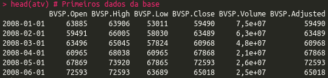

  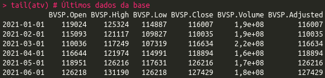

  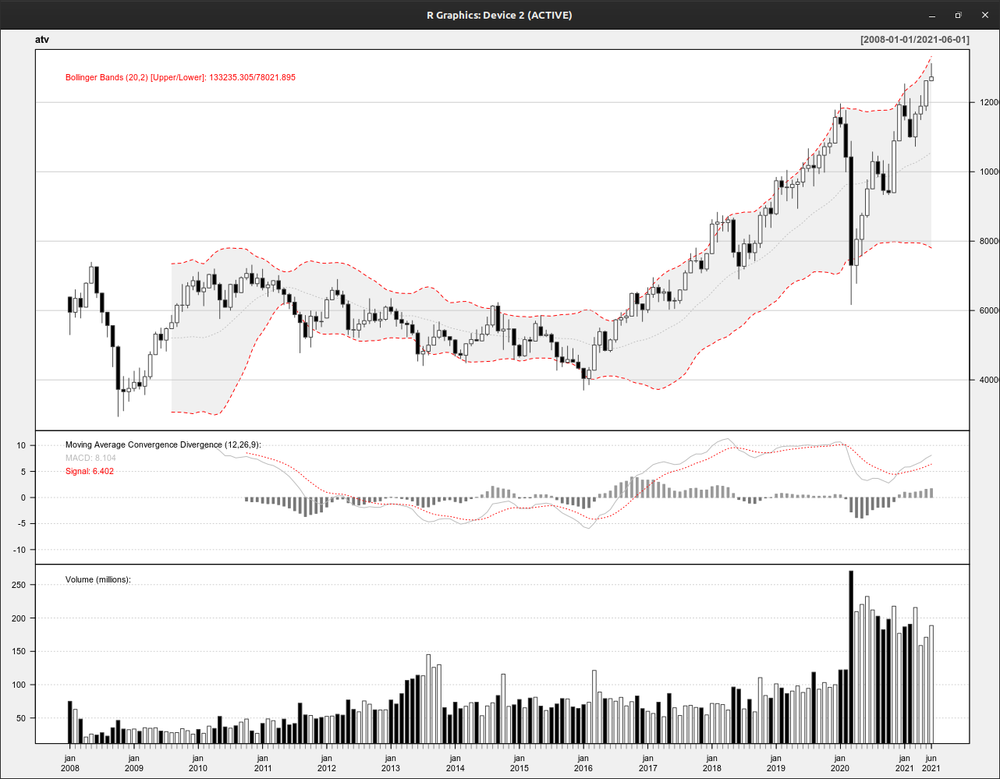

  O estudo justifica-se pela necessidade de entender o comportamento estatístico do Ibovespa, sobretudo, em momentos de maior incerteza da economia local.

### Autocorrelação
  É verificado se existe correlação entre os valores passados do Ibovespa com valores atuais. Abaixo pode-se notar que não existe indicação dessa correlação contínua de influência passada. Apesar da correlção inicalmente ser forte(próximo de 1) observa-se que com o passar da linha de tempo a correlação fica cada vez mais fraca e demonstra uma desconexão dos valores atuais com os anteriores.

  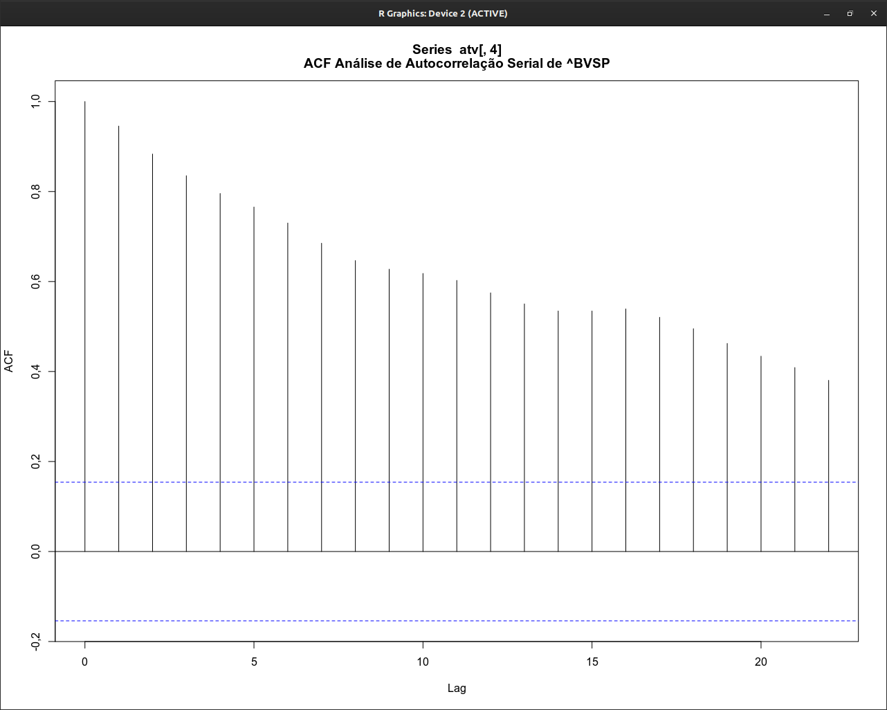

  No gráfico de correlação parcial, tem-se uma faixa mais estreita que indica os limites dessa relação. Mesmo pequena existe uma relação anterior que não explica completamente os valores atuais.

  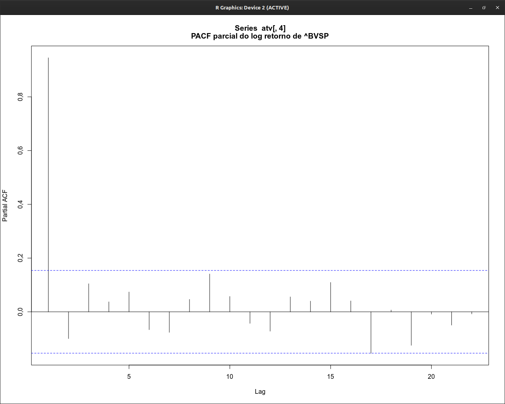

### Análise da variação dos retornos
  Verifica-se com os indicadores gerados abaixo, as variações ao longo do tempo dos retornos do ativo.

  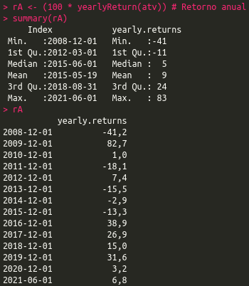

  Observando que mesmo tendo uma maior queda em 2020 do que em 2008, a queda observada na crise do Covid-19 foi de recuperação mais acelerada, fechando dentro do mesmo ano positivamente.

  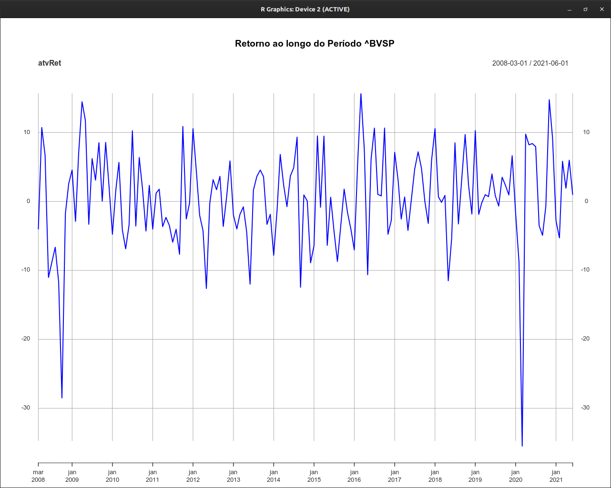

  Observa-se alta volatilidade em momentos de crise.

  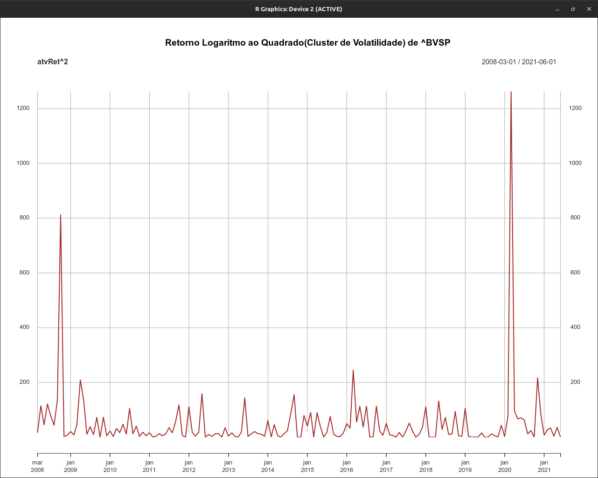

### O Modelo
  Este é um modelo de previsão de uma série de retornos e das suas volatilidades condicionais (MVE), ambas variáveis possuem componentes estocásticos em suas equações. Foi utilizado a teoria de inferência Bayesiana e algoritmos de simulação MCMC para obter os valores dos parâmetros do modelo.
  A análise gráfica mostra períodos de maior variabilidade na época da crise do subprime, em 2008 e 2009, diante das incertezas no cenário internacionais e em 2020, com a incerteza mundial envolvendo a pandemia do Vírus Corona Covid-19 . No restante da série, observa-se alguns curtos 
períodos de maior variabilidade, no entanto, de menor magnitude, se comparados com os períodos citados anteriormente.

Dados do modelo:

  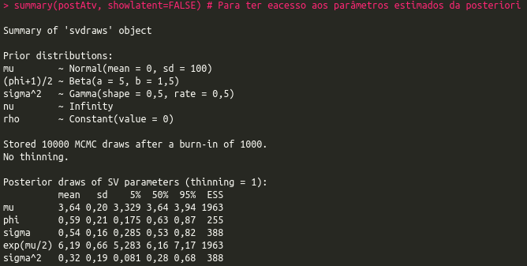

Volatilidade estimada dos retornos:

  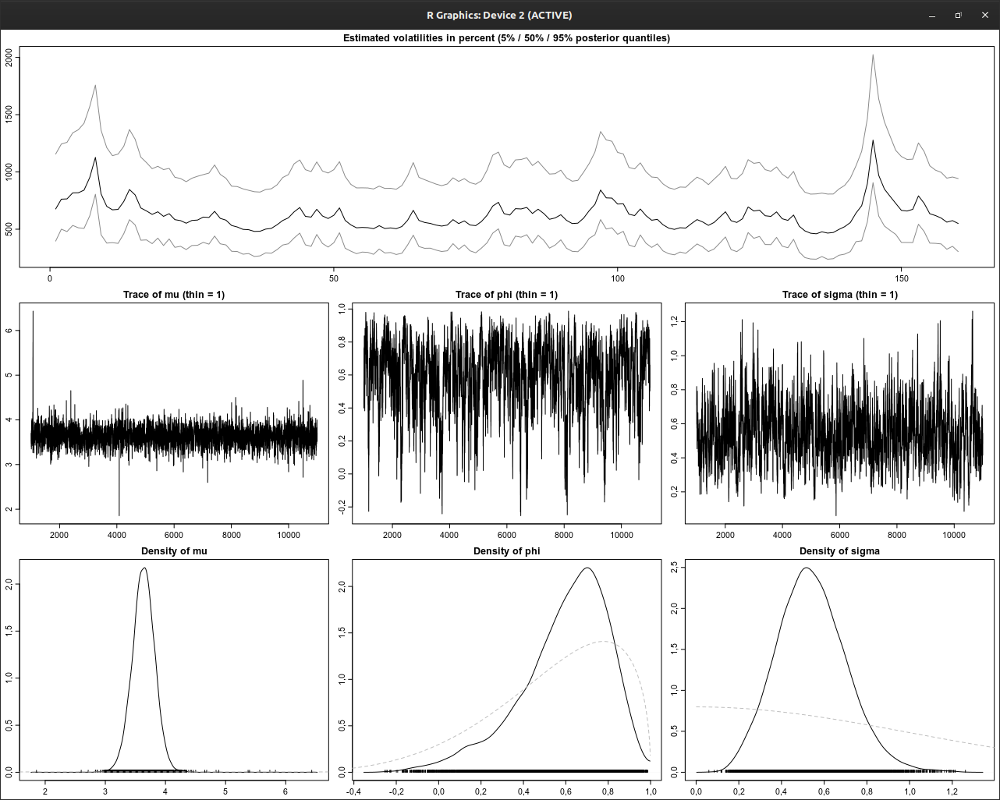

Para análise dos resíduos:

  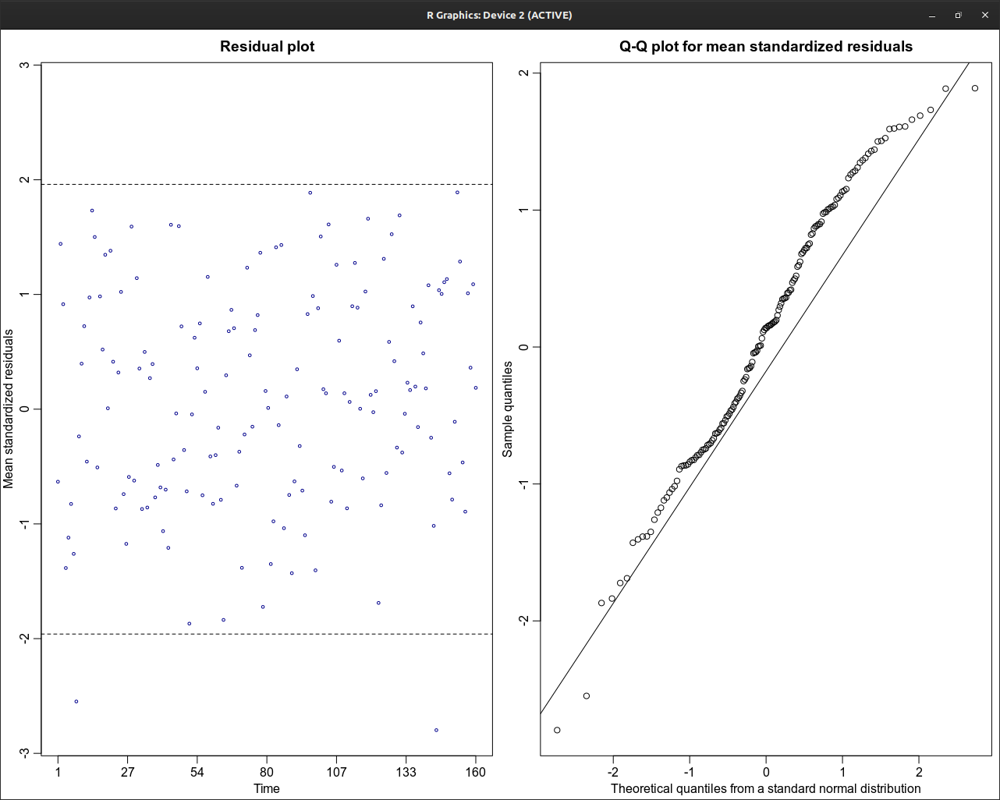

